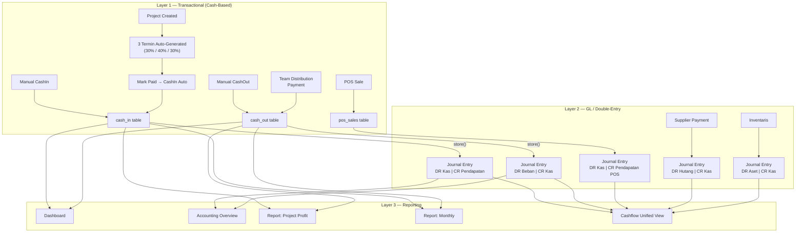
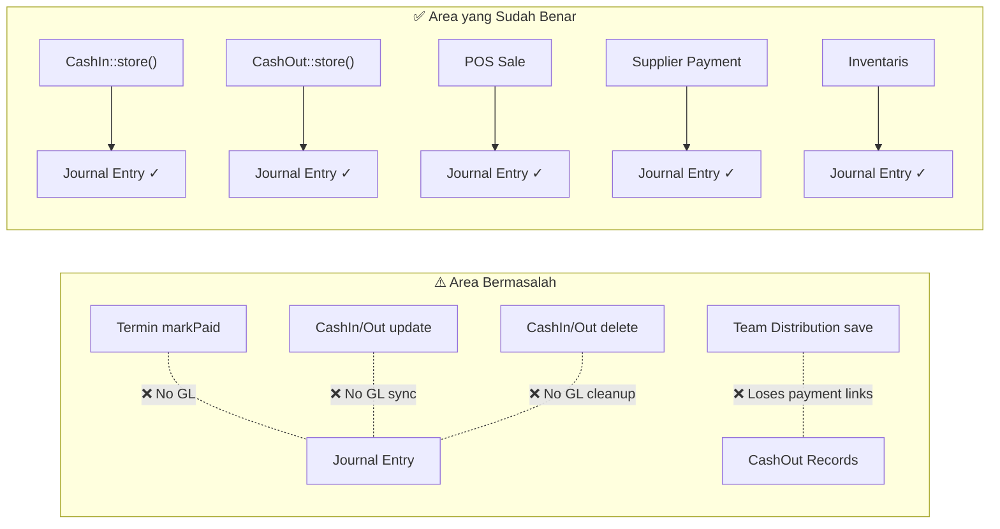

# 🔍 Audit Alur Akunting — PaymentSystemOCN

> **Tanggal Audit**: 28 Mei 2026  
> **Cakupan**: Seluruh alur pencatatan keuangan dari Project → Kas → General Ledger → Laporan

---

## 1. Ringkasan Arsitektur Akunting

Sistem ini memiliki **arsitektur akunting dua lapis** (dual-layer):



---

## 2. Alur Detail Per Modul

### 2.1 Project → Termin → Kas Masuk

| Langkah | Controller | Tabel | GL? |
|---|---|---|---|
| Buat project | `ProjectController::store` | `projects` | ❌ |
| Auto-create 3 termin | `ProjectController::store` | `project_payments` | ❌ |
| Mark termin paid | `ProjectPaymentController::markPaid` | `project_payments` + `cash_in` | ⚠️ **TIDAK** |
| Input kas masuk manual | `CashInController::store` | `cash_in` + `journal_entries` + `journal_lines` | ✅ |

### 2.2 Kas Keluar (Expense)

| Langkah | Controller | Tabel | GL? |
|---|---|---|---|
| Tambah kas keluar | `CashOutController::store` | `cash_out` + `journal_entries` + `journal_lines` | ✅ |
| Bayar anggota tim | `ProjectController::payMember` | `cash_out` + `team_distributions` | ⚠️ **Perlu dicek** |

### 2.3 POS → GL

| Langkah | Controller | GL? |
|---|---|---|
| POS Sale | `ERPSalesController` | ✅ (via `GlPostingService`) |
| POS Refund | `ERPSalesController` | ✅ (side reversal) |

### 2.4 Supplier Payment → GL

| Langkah | Controller | GL? |
|---|---|---|
| Bayar hutang supplier | `ERPAccountingPaymentController` | ✅ |

### 2.5 Inventaris → GL

| Langkah | Controller | GL? |
|---|---|---|
| Catat inventaris | `AccountingInventoryController` | ✅ |

---

## 3. Temuan Masalah (Issues)

### 🔴 CRITICAL — Integritas Data Akunting

#### Issue #1: Termin Payment TIDAK Membuat Journal Entry

**File**: [ProjectPaymentController.php](file:///Users/mbx/Projects/PaymentSystemOCN/app/Http/Controllers/ProjectPaymentController.php#L17-L48)

```php
// markPaid() hanya create/update CashIn tapi TIDAK memanggil GlPostingService
CashIn::updateOrCreate(
    ['project_payment_id' => $payment->id],
    [
        'project_id'  => $payment->project_id,
        'category'    => 'pendapatan_project',
        'amount'      => $payment->amount,
        'date'        => $validated['paid_at'],
        ...
    ]
);
// ⛔ Tidak ada journal entry! Berbeda dengan CashInController::store() yang SELALU posting ke GL
```

**Dampak**: Pemasukan dari termin project **tidak tercatat di General Ledger**. Laporan Accounting Overview dan saldo kas/bank menjadi **tidak akurat** karena ada CashIn tanpa pasangan journal entry. Ini adalah **celah paling kritis** dalam sistem akunting.

---

#### Issue #2: Update CashIn/CashOut TIDAK Mengupdate Journal Entry

**File**: [CashInController.php](file:///Users/mbx/Projects/PaymentSystemOCN/app/Http/Controllers/CashInController.php#L122-L143) & [CashOutController.php](file:///Users/mbx/Projects/PaymentSystemOCN/app/Http/Controllers/CashOutController.php#L115-L136)

```php
public function update(Request $request, CashIn $cashIn) {
    // ... validate ...
    $cashIn->update($validated);
    // ⛔ Journal entry yang terkait TIDAK diupdate/reverse!
}
```

**Dampak**: Jika user mengubah amount atau account dari CashIn/CashOut, journal entry lama tetap menggunakan nilai sebelumnya. **Data GL menjadi out-of-sync** dengan data transaksional.

---

#### Issue #3: Delete CashIn/CashOut TIDAK Menghapus/Reverse Journal Entry

**File**: [CashInController.php](file:///Users/mbx/Projects/PaymentSystemOCN/app/Http/Controllers/CashInController.php#L145-L151) & [CashOutController.php](file:///Users/mbx/Projects/PaymentSystemOCN/app/Http/Controllers/CashOutController.php#L138-L144)

```php
public function destroy(CashIn $cashIn) {
    // ⛔ Journal entry yang terkait TIDAK dihapus/reverse!
    $cashIn->delete();
}
```

**Dampak**: Setelah transaksi dihapus, journal entry-nya tetap ada di GL. Ini menyebabkan **saldo kas/bank phantom** — uang yang sudah tidak ada masih tercatat di ledger.

---

#### Issue #4: Termin markUnpaid Menghapus CashIn Tanpa Journal Cleanup

**File**: [ProjectPaymentController.php](file:///Users/mbx/Projects/PaymentSystemOCN/app/Http/Controllers/ProjectPaymentController.php#L51-L58)

```php
public function markUnpaid(ProjectPayment $payment) {
    CashIn::where('project_payment_id', $payment->id)->delete();
    // ⛔ Jika CashIn sudah punya journal_entry_id (dari re-edit), 
    //    journal entry tidak di-cleanup
}
```

---

### 🟡 HIGH — Inkonsistensi Kalkulasi

#### Issue #5: Dua Definisi Berbeda untuk "Laba Project"

Terdapat **dua formula berbeda** yang digunakan untuk menghitung laba project:

| Lokasi | Formula | Digunakan Di |
|---|---|---|
| [ReportController::projectProfit](file:///Users/mbx/Projects/PaymentSystemOCN/app/Http/Controllers/ReportController.php#L71-L106) | `Laba = CashIn - CashOut` | Halaman laporan project |
| [Project Model](file:///Users/mbx/Projects/PaymentSystemOCN/app/Models/Project.php#L263-L266) | `Laba = CashIn - CashOut` (accessor) | Accessor model |
| [TeamDistributionController](file:///Users/mbx/Projects/PaymentSystemOCN/app/Http/Controllers/TeamDistributionController.php#L159-L207) | `Margin = PaidAmount - MaterialCost - ServiceCost - Operational` | Kalkulator pembagian tim |

**Dampak**: Tim melihat **margin berbeda** di halaman laporan vs halaman pembagian tim. Formula pembagian tim mengecualikan komisi referral dan biaya tim dari perhitungan (padahal tercatat di cash_out).

---

#### Issue #6: `total_value` vs `cashIns->sum('amount')` — Mana yang Benar?

**File**: [TeamDistributionController.php](file:///Users/mbx/Projects/PaymentSystemOCN/app/Http/Controllers/TeamDistributionController.php#L163-L168)

```php
$cashInTotal = (float) $project->cashIns->sum('amount');
$paidAmount = $cashInTotal;
// ...
'total_value' => $paidAmount,  // ⚠️ total_value diisi $paidAmount, bukan projects.total_value
```

Di kalkulator pembagian tim, `total_value` diset ke `$paidAmount` (jumlah yang sudah diterima), **bukan** nilai kontrak project (`$project->total_value`). Ini menyebabkan distributable amount berubah-ubah seiring pembayaran termin masuk, padahal idealnya persentase pembagian dihitung dari nilai kontrak tetap.

---

#### Issue #7: `referral_total` Dihitung tapi TIDAK Dikurangkan dari Margin

**File**: [TeamDistributionController.php](file:///Users/mbx/Projects/PaymentSystemOCN/app/Http/Controllers/TeamDistributionController.php#L176)

```php
$marginAmount = $paidAmount - $directCostTotal - $operationalTotal;
// ⚠️ $referralTotal TIDAK dikurangkan dari margin, padahal dihitung dan ditampilkan
```

Komisi referral dihitung dan dikirim ke frontend (`referral_total`), tapi **tidak diperhitungkan** dalam kalkulasi margin. Ini bisa menyebabkan distributable amount lebih besar dari yang seharusnya.

---

### 🟠 MEDIUM — Masalah Desain & Konsistensi

#### Issue #8: CashflowController Update TIDAK Mengupdate GL (Sama seperti Issue #2)

**File**: [CashflowController.php](file:///Users/mbx/Projects/PaymentSystemOCN/app/Http/Controllers/CashflowController.php#L99-L143)

`updateCashIn()` dan `updateCashOut()` di CashflowController juga hanya update record tanpa menyentuh journal entry.

---

#### Issue #9: CashflowController Delete TIDAK Cleanup GL (Sama seperti Issue #3)

**File**: [CashflowController.php](file:///Users/mbx/Projects/PaymentSystemOCN/app/Http/Controllers/CashflowController.php#L145-L161)

Pattern yang sama — delete hanya menghapus record, bukan journal entry.

---

#### Issue #10: GlPostingService Tidak Ada Validasi Debit = Credit

**File**: [GlPostingService.php](file:///Users/mbx/Projects/PaymentSystemOCN/app/ERP/Accounting/Services/GlPostingService.php#L23-L53)

```php
public function post(..., array $lines): JournalEntry {
    // ⛔ Tidak ada validasi sum(debit) == sum(credit)
    foreach ($lines as $line) {
        JournalLine::query()->create([...]);
    }
}
```

**Dampak**: Jika ada bug di caller yang mengirim debit ≠ credit, journal entry akan **unbalanced**. Prinsip dasar double-entry accounting dilanggar tanpa warning.

---

#### Issue #11: Reconciliation Controller Tidak Menyertakan POS, Supplier, dan Inventaris

**File**: [ReconciliationController.php](file:///Users/mbx/Projects/PaymentSystemOCN/app/Http/Controllers/ReconciliationController.php#L16-L85)

Hanya menarik data dari `cash_in` dan `cash_out`, tidak menyertakan transaksi POS, pembayaran supplier, dan inventaris. Akibatnya, rekon kas/bank **tidak lengkap**.

---

#### Issue #12: Dashboard "Overdue Payments" Membandingkan `total_value` vs `cashIns`

**File**: [DashboardController.php](file:///Users/mbx/Projects/PaymentSystemOCN/app/Http/Controllers/DashboardController.php#L65-L83)

```php
$remaining = max((float) $project->total_value - (float) ($project->paid_amount ?? 0), 0);
```

Jika `total_value` adalah 0 (karena harga diambil dari budget/material), `remaining` akan selalu 0 dan project **tidak akan muncul** di overdue list.

---

#### Issue #13: Team Distribution `save()` Menghapus Semua Lalu Insert Ulang

**File**: [TeamDistributionController.php](file:///Users/mbx/Projects/PaymentSystemOCN/app/Http/Controllers/TeamDistributionController.php#L120-L143)

```php
TeamDistribution::where('project_id', $validated['project_id'])->delete();
foreach ($validated['distributions'] as $dist) {
    TeamDistribution::create([...]);
}
```

Jika anggota tim sudah dibayar (`paid_at` & `cash_out_id` terisi), data pembayaran **terhapus**. UUID baru di-generate, link ke `cash_out` hilang.

---

#### Issue #14: Tidak Ada Audit Trail untuk Perubahan/Penghapusan Transaksi

Meskipun ada trait `Auditable`, deletion dari CashIn/CashOut **tidak** dicatat siapa yang menghapus dan kapan. Tidak ada log reversal di GL.

---

## 4. Diagram Masalah



---

## 5. Rekomendasi Perbaikan

### 🔴 Prioritas 1 — Critical (Segera)

| # | Masalah | Solusi | Effort |
|---|---|---|---|
| 1 | Termin markPaid tanpa GL | Tambahkan `GlPostingService::post()` di `markPaid()` — DR Kas, CR Pendapatan Project. Gunakan `cash_account_id` dari CoA setting atau default. | 2–3 jam |
| 2 | Update tanpa GL sync | Implementasikan pola **reverse-and-repost**: (1) buat journal entry reversal untuk entry lama, (2) buat journal entry baru dengan nilai updated. | 4–6 jam |
| 3 | Delete tanpa GL cleanup | Sebelum delete CashIn/CashOut, reverse journal entry terkait via `JournalEntrySideReversalService` (sudah ada di codebase). | 2–3 jam |
| 4 | markUnpaid GL cleanup | Tambahkan journal reversal sebelum delete CashIn di `markUnpaid()`. | 1–2 jam |

### 🟡 Prioritas 2 — High (Minggu Ini)

| # | Masalah | Solusi | Effort |
|---|---|---|---|
| 5 | Formula laba tidak konsisten | Standarisasi satu formula: `Laba = CashIn - CashOut`. Buat service `ProjectProfitCalculator` yang dipakai oleh semua controller/report. | 3–4 jam |
| 6 | total_value pakai paid_amount | Ubah kalkulator pembagian tim: gunakan `project->total_value` (atau `resolveListTotalValue()`) sebagai basis, bukan `cashIns->sum()`. | 1–2 jam |
| 7 | Referral tidak masuk margin | Tambahkan `$referralTotal` ke pengurangan: `$marginAmount = $paidAmount - $directCostTotal - $operationalTotal - $referralTotal`. | 30 menit |
| 10 | GL tidak validasi balance | Tambahkan assertion di `GlPostingService::post()`: `abort_unless(abs(sum_debit - sum_credit) < 0.01, 500, 'Unbalanced journal entry')` | 30 menit |

### 🟢 Prioritas 3 — Medium (Sprint Berikutnya)

| # | Masalah | Solusi | Effort |
|---|---|---|---|
| 11 | Rekon tidak lengkap | Gabungkan data POS, supplier payment, inventaris ke `ReconciliationController`. | 3–4 jam |
| 12 | Overdue detection | Gunakan `resolveListTotalValue()` bukan `total_value` langsung. | 1 jam |
| 13 | Team distribution delete-all | Ubah ke upsert pattern: match by `project_id + user_id`, preserve `cash_out_id` & `paid_at` untuk yang sudah dibayar. | 2–3 jam |
| 14 | Audit trail deletion | Catat deletion event di audit trail table sebelum hard delete. Tambahkan soft-delete untuk CashIn/CashOut. | 2–3 jam |

---

## 6. Kesimpulan

### Yang Sudah Baik ✅

1. **Double-entry accounting** sudah diimplementasikan via `GlPostingService` + `JournalEntry/JournalLine`
2. **Fiscal period control** — transaksi pada periode tertutup dicegah
3. **Category-to-CoA mapping** — setiap kategori kas di-mapping ke akun GL yang sesuai
4. **Multi-company support** — journal entries scoped ke company
5. **Unified cashflow view** — CashflowController menggabungkan semua sumber (project, POS, supplier, inventaris, manual)
6. **Opening balance calculation** — saldo awal dihitung dari journal lines sebelum periode

### Yang Harus Diperbaiki ⛔

1. **Inkonsistensi GL posting** — Jalur termin (`markPaid`) bypass GL, sementara jalur manual (`CashInController::store`) posting ke GL. **Ini adalah masalah paling kritis.**
2. **Lifecycle GL tidak lengkap** — Hanya `create` yang posting ke GL. `update` dan `delete` tidak menyentuh GL, menyebabkan data out-of-sync.
3. **Formula kalkulasi tidak standar** — Laba project dihitung dengan cara berbeda di halaman berbeda.
4. **Kehilangan data saat re-save team distribution** — Payment links terhapus.

### Skor Kematangan

| Aspek | Skor | Catatan |
|---|---|---|
| Chart of Accounts | ⭐⭐⭐⭐ | Lengkap dengan cash/bank flag |
| Double-Entry Integrity | ⭐⭐☆☆ | Ada tapi tidak konsisten di semua jalur |
| Transaction Lifecycle | ⭐⭐☆☆ | Create OK, update/delete broken |
| Reporting Consistency | ⭐⭐⭐☆ | Bagus tapi formula tidak seragam |
| Audit Trail | ⭐⭐☆☆ | Auditable trait ada, tapi deletion tidak di-track |
| Period Control | ⭐⭐⭐⭐ | FiscalPeriodService sudah solid |
| Multi-Source Integration | ⭐⭐⭐⭐ | POS, Supplier, Inventaris terintegrasi |

**Skor Keseluruhan: 2.7 / 5** — Fondasi kuat, tapi ada celah kritis di lifecycle transaksi dan konsistensi GL yang harus ditutup sebelum sistem digunakan untuk pelaporan keuangan yang akurat.
