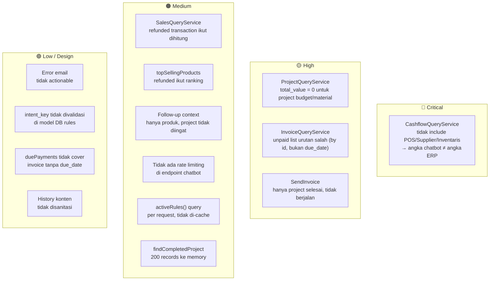

# 🤖 Audit Sistem Assistant (Chatbot ERP) — PaymentSystemOCN

> **Tanggal Audit**: 28 Mei 2026
> **Cakupan**: Seluruh komponen sistem chatbot/assistant ERP — controller, query services, parser, model, routing, dan integrasi data
> **File Utama**: `ErpChatbotController`, `RuleBasedErpChatParser`, `ErpChatbot/*QueryService`, `ErpChatParserRule`

---

## 1. Ringkasan Arsitektur

Sistem assistant menggunakan pendekatan **rule-based NLU** (Natural Language Understanding) tanpa LLM. Alur lengkap:

```
User Input
    ↓
RuleBasedErpChatParser::parse()
    ├─ normalize() → synonym map + squish
    ├─ fuzzyContains() → typo tolerance (Levenshtein ≤25%)
    └─ match built-in rules / DB rules (ErpChatParserRule)
         ↓ matched intent_key
ErpChatbotController::ask()
    ├─ tryFollowUp() — context cache (15 menit)
    ├─ answerNoMatch() → suggestClosest()
    └─ match($intent) → handler method
         ↓
*QueryService (ProductQuery / SalesQuery / CashflowQuery / ProjectQuery / InvoiceQuery)
    ↓
Formatted markdown response → JSON
```

### Komponen Utama

| Komponen | File | Peran |
|---|---|---|
| Controller | `ErpChatbotController.php` | Routing intent → handler |
| Parser | `RuleBasedErpChatParser.php` | NLU: tokenize, synonym, fuzzy match |
| Product Query | `ProductQueryService.php` | Stok, harga, detail produk |
| Sales Query | `SalesQueryService.php` | POS summary, top-selling |
| Cashflow Query | `CashflowQueryService.php` | Cashflow summary, operasional |
| Project Query | `ProjectQueryService.php` | Project aktif, invoice lookup |
| Invoice Query | `InvoiceQueryService.php` | Unpaid/due invoice, send log |
| Model Rule | `ErpChatParserRule.php` | Rule DB (override built-in) |

---

## 2. Inventaris Intent yang Didukung

| Intent Key | Trigger Contoh | Handler |
|---|---|---|
| `greeting` | "halo", "selamat pagi", "hi" | `answerGreeting()` |
| `stock_lookup` | "stok lid cup", "sisa barang" | `answerStockLookup()` |
| `product_price_lookup` | "harga standing pouch" | `answerPriceLookup()` |
| `product_detail` | "detail produk X", "info barang" | `answerProductDetail()` |
| `low_stock_alert` | "stok rendah", "hampir habis" | `answerLowStockAlert()` |
| `top_selling_products` | "produk terlaris", "best seller" | `answerTopSellingProducts()` |
| `invoice_unpaid_list` | "invoice belum dibayar" | `answerUnpaidInvoiceList()` |
| `invoice_due_list` | "invoice jatuh tempo" | `answerInvoiceDueList()` |
| `pos_sales_today` | "pos hari ini", "penjualan hari ini" | `answerPosSalesToday()` |
| `pos_sales_yesterday` | "pos kemarin" | `answerPosSalesYesterday()` |
| `pos_sales_month` | "penjualan bulan ini" | `answerPosSalesMonth()` |
| `pos_sales_last_month` | "penjualan bulan lalu" | `answerPosSalesLastMonth()` |
| `cashflow_today` | "cashflow hari ini", "kas hari ini" | `answerCashflowToday()` |
| `cashflow_yesterday` | "cashflow kemarin" | `answerCashflowYesterday()` |
| `cashflow_month` | "cashflow bulan ini" | `answerCashflowMonth()` |
| `cashflow_last_month` | "cashflow bulan lalu" | `answerCashflowLastMonth()` |
| `project_active_list` | "project aktif", "daftar project" | `answerProjectActiveList()` |
| `operational_summary` | "biaya operasional", "pengeluaran" | `answerOperationalSummary()` |
| `send_invoice` | "kirim invoice INV-XXX ke email" | `answerSendInvoice()` |
| `invoice_sent_list` | "list invoice yang dikirim" | `answerInvoiceSentList()` |
| `help` | "bantuan", "cara pakai" | `answerHelp()` |

**Total: 21 intent terdaftar, semua sudah ada handler-nya.**

---

## 3. Analisis Fitur Parser

### 3.1 Kekuatan Parser

**Fuzzy matching (Levenshtein ≤25% per kata)**
Contoh: `"casflow"` → terdeteksi sebagai `cashflow`. Threshold 25% cukup permisif untuk typo umum (1-2 karakter) pada kata pendek, dan ketat cukup untuk mencegah false positive pada kata panjang.

**Synonym normalization (±80 pasangan)**
Normalisasi berjalan sebelum matching. Urutan replace dari terpanjang ke terpendek (greedy) mencegah partial replace yang salah. Contoh: `"penjualan bulan lalu"` → `"pos bulan lalu"` sebelum di-match ke rule.

**Specificity scoring**
Ketika beberapa rule match, rule dengan keyword terpanjang/terbanyak kata yang dipilih. Ini mencegah rule "stok" (1 kata) mengalahkan "stok rendah" (2 kata) pada input "stok rendah".

**DB rules override**
`ErpChatParserRule` memungkinkan admin menambah/mengubah rule via UI tanpa deploy. Fallback ke `BUILT_IN_RULES` jika tabel kosong.

**Context-aware follow-up**
Session context disimpan di Cache (15 menit). Setelah tanya "stok lid cup", user bisa tanya "harganya?" dan sistem mengetahui produk yang dimaksud. Fallback via history scan (regex `**ProductName**` dari respons sebelumnya).

### 3.2 Kelemahan dan Masalah Parser

**⚠️ Tidak ada handling untuk kombinasi intent**
Contoh: "stok dan harga lid cup" akan memilih satu intent saja (yang lebih spesifik). User tidak bisa mendapat dua informasi dalam satu pertanyaan.

**⚠️ Synonym map dan typoMap di-hardcode**
Tidak bisa diubah admin tanpa deploy. Padahal `ErpChatParserRule` sudah ada sebagai mekanisme DB override untuk rules — perlu konsistensi.

**⚠️ `fuzzyContains()` untuk multi-word keyword pakai exact `Str::contains()`**
Keyword multi-kata seperti `"invoice belum dibayar"` tidak mendapat fuzzy matching — hanya exact. Typo di tengah frase gagal match. Padahal synonym map sudah menangani banyak kasus ini, tapi tidak semua.

---

## 4. Analisis Query Services

### 4.1 CashflowQueryService

```php
// Masalah: hanya menarik dari cash_in dan cash_out
$cashIn  = CashIn::query()->whereBetween('date', [$start, $end])->sum('amount');
$cashOut = CashOut::query()->whereBetween('date', [$start, $end])->sum('amount');
```

**🔴 Issue #C1 — Cashflow chatbot tidak menyertakan POS, Supplier Payment, dan Inventaris**

`CashflowController` (unified view) sudah menggabungkan 5 sumber data: `cash_in`, `cash_out`, `pos_sales`, `payable_payments`, dan `accounting_inventory_records`. Tapi `CashflowQueryService` untuk chatbot hanya menarik 2 sumber. Ini menyebabkan **angka cashflow di chatbot berbeda** dari yang ditampilkan di halaman Cashflow ERP.

**Dampak**: Angka "kas masuk hari ini" via chatbot bisa jauh lebih kecil dari realita jika ada transaksi POS atau pembayaran supplier di hari yang sama.

### 4.2 ProjectQueryService

```php
public function activeProjects(int $limit = 10): Collection
{
    return Project::query()
        ->where('status', 'berjalan')
        ->orderByDesc('created_at')
        ->limit($limit)
        ->get(['id', 'name', 'client_name', 'total_value', 'started_at']);
}
```

**🟡 Issue #P1 — `total_value` bisa 0 untuk project berbasis budget/material**

`answerProjectActiveList()` menampilkan `total_value` langsung dari kolom. Sama seperti bug di DashboardController (sudah diperbaiki), project yang nilai kontraknya dari budget/material akan menampilkan "Rp 0" di chatbot. `resolveListTotalValue()` tidak dipanggil karena query menggunakan select spesifik dan tidak me-load relasi.

**🟠 Issue #P2 — `findCompletedProjectByInvoiceNumber()` memuat 200 record ke memory**

```php
->limit(200)
->get()
->first(function (Project $candidate) use ($invoiceNumber): bool {
    return Str::lower($this->invoiceNumber($candidate)) === Str::lower($invoiceNumber);
});
```

Untuk mencari project berdasarkan invoice number yang di-generate (bukan tersimpan di DB), seluruh 200 project dimuat ke PHP. Seharusnya cukup untuk skala saat ini, tapi akan menjadi bottleneck seiring data bertambah.

### 4.3 InvoiceQueryService

```php
public function unpaidProjectPayments(int $limit = 8): Collection
{
    return ProjectPayment::query()
        ->with('project:id,name,invoice_number')
        ->whereNull('paid_at')
        ->orderByDesc('id')
        ->limit($limit)
        ->get();
}
```

**🟡 Issue #I1 — Tidak ada filter `due_date` di `unpaidProjectPayments()`**

List "invoice belum dibayar" diurutkan by `id` DESC (terbaru dibuat), bukan by due date atau jumlah terbesar. Lebih berguna jika yang paling urgent (overdue atau hampir jatuh tempo) ditampilkan di atas.

**🟠 Issue #I2 — `dueProjectPaymentsWithinDays()` tidak menyertakan invoice yang sudah overdue tanpa `due_date`**

Hanya menarik `whereNotNull('due_date')`. Invoice tanpa due date tidak akan muncul meski sudah lama belum dibayar.

### 4.4 SalesQueryService

```php
$query = PosSale::query()
    ->whereBetween('sold_at', [$startDate.' 00:00:00', $endDate.' 23:59:59']);
```

**🟠 Issue #S1 — Query POS tidak mem-filter status `refunded`**

Transaksi yang di-refund masih ikut dihitung dalam total penjualan. Seharusnya filter `where('status', '!=', 'refunded')` atau hanya ambil `status = 'paid'`.

**🟠 Issue #S2 — `topSellingProducts()` tidak mem-filter transaksi refunded**

Join ke `pos_sales` tapi tidak ada `WHERE pos_sales.status = 'paid'`. Produk dari transaksi refund masih terhitung sebagai "terlaris".

### 4.5 ProductQueryService

Tidak ada masalah signifikan. Query sudah efisien, select spesifik, index-friendly. `lowStockProducts()` sudah ada filter `low_stock_alert_enabled = true` agar tidak spam alert untuk produk yang memang selalu 0.

---

## 5. Analisis Controller (ErpChatbotController)

### 5.1 Send Invoice Flow

**✅ Yang sudah baik:**
- Two-step confirmation (preview dulu → konfirmasi) mencegah kirim invoice tidak sengaja
- Log ke `InvoiceSendLog` baik sukses maupun gagal
- Regex parse `INV-...` dari input natural language

**🟡 Issue #A1 — `answerSendInvoice()` hanya bisa kirim invoice project `status = 'selesai'`**

```php
$project = $this->projectQueries->findCompletedProjectByInvoiceNumber($invoiceNo);
```

Project dengan status `berjalan` tidak bisa dikirim invoice-nya via chatbot. Tapi di halaman ERP Sales (`erp.sales.project-invoices`), invoice bisa didownload untuk semua project. Inkonsistensi UX.

**🔴 Issue #A2 — Email error tidak memberikan informasi yang actionable**

```php
return '❌ Gagal mengirim invoice. Cek konfigurasi mail (MAIL_MAILER/SMTP) dan alamat email tujuan.';
```

Pesan error selalu sama tanpa konteks spesifik (apakah email tidak valid, SMTP timeout, dll). Padahal `$e->getMessage()` sudah di-log — seharusnya disertakan sebagian untuk membantu diagnosis.

### 5.2 Follow-up Context

**🟠 Issue #A3 — Context follow-up hanya untuk produk, tidak untuk project/invoice**

`rememberProject()` dan `rememberIntent()` dipanggil tapi tidak digunakan di `tryFollowUp()`. Setelah tanya "project aktif", tidak bisa tanya "detail project pertama" atau "kirim invoice project itu".

### 5.3 `answerProjectActiveList()` menggunakan `total_value` mentah

```php
$value = number_format((float) $p->total_value, 0, ',', '.');
```

Masalah sama dengan Issue #P1 — project berbasis budget/material tampil Rp 0.

### 5.4 Rate limiting & Security

**🟠 Issue #A4 — Endpoint `/erp/chatbot/ask` hanya dilindungi `middleware('auth')`**

Tidak ada rate limiting khusus pada endpoint ini. User authenticated bisa spam request. Endpoint `/` (landing) sudah punya `throttle:landing-public` dan `throttle:landing-track` tapi chatbot tidak.

**🟠 Issue #A5 — History dari frontend tidak divalidasi isinya**

```php
'history' => 'nullable|array|max:10',
'history.*.role' => 'required_with:history|string|in:user,assistant',
'history.*.text' => 'required_with:history|string|max:2000',
```

Validasi ada, max:2000 per item × 10 item = 20.000 karakter per request hanya untuk history. Tidak ada sanitasi untuk injeksi konten berbahaya di `history.*.text` yang digunakan untuk scan produk.

---

## 6. Analisis Model ErpChatParserRule

Model sudah baik: `keywords` di-cast sebagai array, ada `priority`, `is_active`, `match_mode`. Namun:

**🟠 Issue #M1 — Tidak ada validasi `intent_key` di model/migration**

`intent_key` bisa diisi sembarang string. Rule dengan `intent_key = 'xyz'` yang tidak ada handler-nya akan menghasilkan response: `"Intent dikenali tapi handler belum tersedia untuk: xyz"` — terlalu eksplisit dan tidak user-friendly.

**🟠 Issue #M2 — Tidak ada cache untuk `activeRules()`**

Setiap request chatbot melakukan query `ErpChatParserRule::where('is_active', true)->get()`. Jika tabel DB rules terisi banyak, ini menjadi query berulang yang bisa di-cache per beberapa menit.

---

## 7. Diagram Alur Masalah



---

## 8. Tabel Temuan

| # | Severity | Komponen | Masalah | Dampak |
|---|---|---|---|---|
| C1 | 🔴 Critical | `CashflowQueryService` | Hanya cash_in + cash_out, tidak include POS/Supplier/Inventaris | Angka cashflow chatbot tidak cocok dengan halaman ERP |
| P1 | 🟡 High | `ProjectQueryService` | `total_value` mentah, bisa 0 untuk project budget/material | Project tampil "Rp 0" di chatbot |
| I1 | 🟡 High | `InvoiceQueryService` | Unpaid list urut by ID DESC bukan by urgency/due_date | Invoice paling urgent tidak muncul di atas |
| A1 | 🟡 High | `ErpChatbotController` | Send invoice hanya untuk project `selesai` | Tidak bisa kirim invoice project `berjalan` via chatbot |
| S1 | 🟠 Medium | `SalesQueryService` | Refunded transaction ikut dihitung di total POS | Total penjualan chatbot lebih besar dari aktual |
| S2 | 🟠 Medium | `SalesQueryService` | `topSellingProducts` tidak filter refunded | Ranking produk terlaris tidak akurat |
| A3 | 🟠 Medium | `ErpChatbotController` | Follow-up context hanya produk, project tidak di-remember | Tidak bisa follow-up setelah tanya project |
| A4 | 🟠 Medium | Route | Tidak ada rate limiting di endpoint chatbot | Rentan spam/abuse |
| M2 | 🟠 Medium | `RuleBasedErpChatParser` | `activeRules()` query tiap request | N+1 query risk jika rules banyak |
| P2 | 🟠 Medium | `ProjectQueryService` | Load 200 project ke memory untuk invoice lookup | Bottleneck seiring data tumbuh |
| A2 | 🟢 Low | `ErpChatbotController` | Error email tidak actionable | User tidak tahu penyebab spesifik |
| M1 | 🟢 Low | `ErpChatParserRule` | `intent_key` tidak divalidasi | Response "Intent tidak tersedia" muncul |
| I2 | 🟢 Low | `InvoiceQueryService` | Invoice tanpa `due_date` tidak muncul di due list | Due alert tidak lengkap |
| A5 | 🟢 Low | `ErpChatbotController` | History konten tidak disanitasi | Potensi injeksi via history text |

---

## 9. Rekomendasi Perbaikan

### 🔴 Prioritas 1 — Critical (Segera)

**C1 — Sinkronkan CashflowQueryService dengan sumber data lengkap**

```php
// CashflowQueryService::summarizePeriod() — tambahkan POS dan Supplier Payment
public function summarizePeriod(string $startDate, string $endDate): array
{
    $cashIn  = (float) CashIn::query()->whereBetween('date', [$startDate, $endDate])->sum('amount');
    $posSales = (float) PosSale::query()
        ->whereNotIn('status', ['refunded'])
        ->whereBetween('sold_at', [$startDate.' 00:00:00', $endDate.' 23:59:59'])
        ->sum('grand_total');
    $posRefunds = (float) PosSale::query()
        ->where('status', 'refunded')
        ->whereBetween('sold_at', [$startDate.' 00:00:00', $endDate.' 23:59:59'])
        ->sum('grand_total');

    $cashOut = (float) CashOut::query()->whereBetween('date', [$startDate, $endDate])->sum('amount');
    $supplierPayments = (float) PayablePayment::query()
        ->whereBetween('payment_date', [$startDate, $endDate])
        ->sum('amount');
    $inventaris = (float) AccountingInventoryRecord::query()
        ->whereBetween('acquisition_date', [$startDate, $endDate])
        ->sum('amount');

    $totalIn  = $cashIn + $posSales;
    $totalOut = $cashOut + $posRefunds + $supplierPayments + $inventaris;

    return [
        'cash_in'  => $totalIn,
        'cash_out' => $totalOut,
        'net'      => $totalIn - $totalOut,
    ];
}
```

Estimasi effort: **1–2 jam**

---

### 🟡 Prioritas 2 — High (Minggu Ini)

**P1 — Gunakan `resolveListTotalValue()` di chatbot project list**

```php
// ProjectQueryService::activeProjects() — load relasi agar resolveListTotalValue() bekerja
public function activeProjects(int $limit = 10): Collection
{
    return Project::query()
        ->where('status', 'berjalan')
        ->with(['convertedBudget.items', 'materials.product'])  // tambahkan ini
        ->orderByDesc('created_at')
        ->limit($limit)
        ->get(['id', 'name', 'client_name', 'total_value', 'started_at']);
}

// ErpChatbotController::answerProjectActiveList()
$lines = $projects->map(function (Project $p): string {
    $value = number_format($p->resolveListTotalValue(), 0, ',', '.');  // ganti ini
    // ...
```

Estimasi effort: **30 menit**

**I1 — Ubah urutan unpaid invoice menjadi by amount DESC**

```php
public function unpaidProjectPayments(int $limit = 8): Collection
{
    return ProjectPayment::query()
        ->with('project:id,name,invoice_number')
        ->whereNull('paid_at')
        ->orderByDesc('amount')   // ganti dari orderByDesc('id')
        ->limit($limit)
        ->get();
}
```

Estimasi effort: **15 menit**

**A1 — Izinkan send invoice untuk project `berjalan` juga**

```php
// ProjectQueryService::findCompletedProjectByInvoiceNumber() — hapus filter status
public function findProjectByInvoiceNumber(string $invoiceNumber): ?Project
{
    $project = Project::query()
        ->whereIn('status', ['selesai', 'berjalan'])  // perluas filter
        ->whereRaw('LOWER(invoice_number) = ?', [Str::lower($invoiceNumber)])
        ->first();
    // ...
```

Estimasi effort: **30 menit**

---

### 🟠 Prioritas 3 — Medium (Sprint Berikutnya)

**S1 + S2 — Filter refunded di SalesQueryService**

```php
// summarizePeriod() — tambahkan filter status
$query = PosSale::query()
    ->where('status', '!=', 'refunded')  // tambahkan ini
    ->whereBetween('sold_at', [...]);

// topSellingProducts() — tambahkan join condition
->where('pos_sales.status', '!=', 'refunded')  // tambahkan ini
```

Estimasi effort: **30 menit**

**A4 — Tambahkan rate limiting untuk endpoint chatbot**

```php
// routes/web.php
Route::post('erp/chatbot/ask', [ErpChatbotController::class, 'ask'])
    ->middleware(['throttle:30,1'])  // 30 request per menit
    ->name('erp.chatbot.ask');
```

Estimasi effort: **15 menit**

**M2 — Cache `activeRules()` per 5 menit**

```php
public function activeRules(): Collection
{
    return Cache::remember('erp_chat_parser_rules', 300, function () {
        $databaseRules = ErpChatParserRule::query()
            ->where('is_active', true)
            ->orderBy('priority')
            ->orderBy('id')
            ->get();
        // ...
    });
}
// Jangan lupa bust cache saat admin update rules
```

Estimasi effort: **1 jam** (termasuk cache invalidation di `ERPAdministrationMasterDataController`)

**P2 — Optimasi `findCompletedProjectByInvoiceNumber()` dengan generated invoice number**

Pertimbangkan menyimpan generated invoice number ke kolom `invoice_number` saat project selesai, sehingga query cukup `WHERE invoice_number = ?` tanpa load 200 records. Estimasi effort: **2–3 jam**

**A3 — Extend follow-up context ke project**

Tambahkan `tryFollowUpFromProject()` yang menggunakan `$ctx['project_id']` untuk pertanyaan lanjutan seperti "nilai kontraknya?" atau "kirim invoicenya". Estimasi effort: **2–3 jam**

---

## 10. Kesimpulan

### Yang Sudah Baik ✅

1. **Arsitektur rule-based** yang solid — mudah dipahami, maintainable, tidak bergantung LLM
2. **21 intent** tersedia dengan handler lengkap, tidak ada dead intent
3. **Fuzzy matching + synonym map** yang komprehensif (80+ sinonim, typo tolerance Levenshtein)
4. **Context-aware follow-up** untuk produk dengan cache 15 menit
5. **Two-step confirmation** untuk send invoice — mencegah aksi destruktif tidak sengaja
6. **DB rules override** — admin bisa tambah rule tanpa deploy
7. **Audit log** untuk pengiriman invoice (`InvoiceSendLog`)
8. **Spesificity scoring** mencegah rule pendek mengalahkan rule lebih spesifik

### Yang Harus Diperbaiki ⛔

1. **Cashflow chatbot ≠ cashflow ERP** — Perbedaan sumber data membuat user bingung saat angka berbeda
2. **Project total_value = 0** — Bug warisan yang sudah diperbaiki di Dashboard dan TeamDistribution, tapi belum di chatbot
3. **Refunded POS ikut terhitung** — Angka penjualan dan produk terlaris tidak akurat
4. **Tidak ada rate limiting** — Endpoint rentan abuse

### Skor Kematangan

| Aspek | Skor | Catatan |
|---|---|---|
| Kelengkapan Intent | ⭐⭐⭐⭐⭐ | 21 intent, semua ada handler |
| Akurasi Data | ⭐⭐☆☆☆ | Cashflow & POS tidak akurat |
| Kualitas NLU | ⭐⭐⭐⭐☆ | Fuzzy + synonym sudah solid |
| Keamanan | ⭐⭐⭐☆☆ | Auth ada, rate limit belum |
| Konsistensi dengan ERP | ⭐⭐☆☆☆ | Angka berbeda antara chatbot dan halaman ERP |
| Maintainability | ⭐⭐⭐⭐☆ | Service separation baik, parser DB override ada |
| Follow-up / Context | ⭐⭐⭐☆☆ | Hanya produk, belum project/invoice |

**Skor Keseluruhan: 3.0 / 5** — Fitur lengkap dan arsitektur bersih, tapi ada celah serius di akurasi data cashflow dan konsistensi dengan tampilan ERP yang harus segera diperbaiki.

---

*Dokumen ini dibuat berdasarkan analisis kode statis pada: 28 Mei 2026*
*Revisi berikutnya setelah perbaikan Prioritas 1 dan 2 selesai diimplementasi.*
